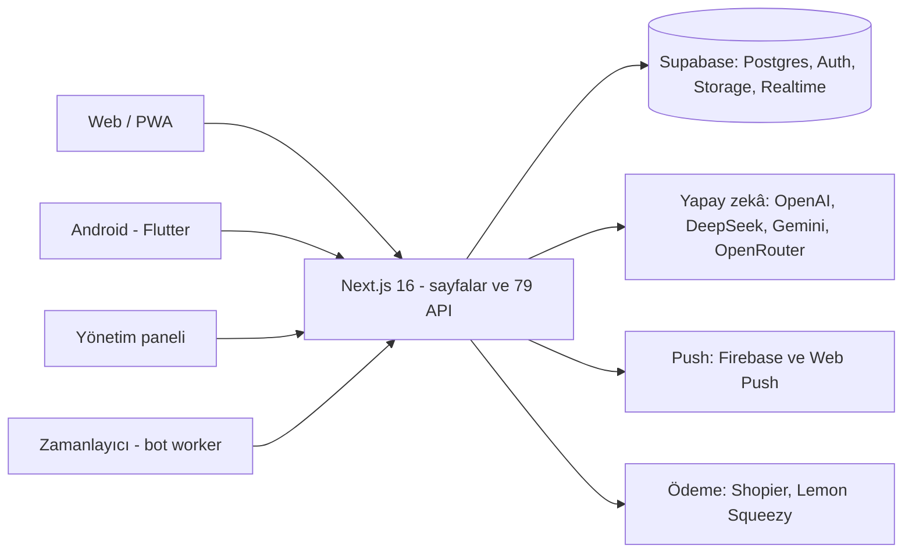

# Lovask — ürün dosyası

Lovask; web, Android ve yönetim panelinden oluşan, kendi sunucunuzda çalıştırabileceğiniz eksiksiz bir tanışma platformudur. Üyelik başvurusu, keşif, eşleşme, sohbet, hikâyeler, premium üyelik, ödeme, moderasyon, botlar ve büyüme araçları tek kod tabanındadır.

## Rakamlarla

| | |
| --- | --- |
| Web sayfası | 35 (17'si yönetim paneli) |
| API uç noktası | 79 |
| Veritabanı | 71 sıralı migration, 84 tablo, 6.300+ satır SQL |
| Satır düzeyi güvenlik | 81 tabloda RLS, 85 erişim politikası |
| Web ve API kodu | 25.000+ satır TypeScript |
| Android uygulaması | 18 ekran, 16.000+ satır Flutter/Dart, sürüm 1.9.11 (39) |
| Test ve denetim betiği | 45 uçtan uca/duman/denetim betiği, 7 Flutter testi, 15 QA raporu (`docs/qa/`) |

## Mimari

Tek veritabanı, üç istemci. Web'de yapılan her şey Android'de, Android'de yapılan her şey yönetim panelinde anında görünür (Supabase Realtime).

## Neler var

Tüm liste yönetim panelindeki **Platform özeti** sayfasında canlı kurulum durumuyla birlikte görünür. Başlıklar:

- **Keşif ve eşleşme:** kart kaydırma, süper beğeni, geri alma, Boost, beğenenler ve ziyaretçiler, çevrimiçi durum
- **Sohbet:** gerçek zamanlı mesajlaşma, sesli ve fotoğraflı mesaj, AI Wingman
- **Topluluk:** 24 saatlik hikâyeler, buluşma planları, sesli biyografi
- **Gelir:** Noir VIP üyelik, Shopier ve Lemon Squeezy, dekont ve Telegram üzerinden onay, davet ve referans
- **Güven:** fotoğraf moderasyonu, selfie doğrulama, şikâyet ve engelleme, Turnstile, hız sınırı, 30 günlük hesap kurtarma
- **Büyüme:** büyüme paneli, indirme takibi, blog ve SEO, PWA
- **Yönetim:** dört rollü panel (sahip, moderatör, destek, bot editörü), bot stüdyosu, başvuru akışı, canlı destek, sistem sağlığı
- **Mobil:** Android uygulaması, push bildirimleri, Google ile giriş

## Bot sistemi

Yeni bir uygulamanın en büyük sorunu boş görünmesidir. Lovask bunu çözen bir bot altyapısıyla gelir: persona ve fotoğraf havuzu, gecikmeli eşleşme, mesaj hızı sınırı, yapay zekâ sağlayıcısı yedekleme sırası ve panelden bot açma/kapama.

## Güvenlik ve işletme

- Tüm tablolarda satır düzeyi güvenlik; hassas medya özel depolama alanlarında
- Gizli anahtarlar yalnızca sunucu ortamında; `service_role` hiçbir istemciye gitmez
- Kayıt ve giriş için Cloudflare Turnstile, HMAC imzalı hız sınırlama
- Ödeme webhook'ları imza ve mükerrer kayıt kontrollü; başarısız webhook sayısı sağlık ekranında
- Hesap silme 30 günlük kurtarma süresiyle çalışır (gizlilik metinlerini kendi hukuk danışmanınızla gözden geçirin)
- Sistem sağlığı ekranı kapasite ve servis durumunu gösterir; `scripts/ops-backup.sh` yedekleme için hazırdır

## Kurulum

`docs/KURULUM.md` rehberiyle yaklaşık 30 dakika:

1. `supabase/INSTALL.sql` tek seferde çalıştırılır
2. `npm run setup` gizli anahtarları üretir
3. `npm run doctor` neyin eksik olduğunu söyler
4. `docker compose --env-file .env.local up -d --build` siteyi otomatik HTTPS ve bot zamanlayıcısıyla başlatır
5. `npm run rebrand -- --domain alanadiniz.com` alan adını ve mobil varsayılanları kendi markanıza çevirir

## Teslimatta ne var

Kaynak kodun tamamı (web, API, yönetim paneli, Flutter uygulaması), veritabanı kurulumu ve migration geçmişi, Docker dosyaları, kurulum ve markalama betikleri, QA raporları ve Flutter mimari belgeleri. Gerçek ortam anahtarları, sunucu bilgileri ve kullanıcı verileri pakete **girmez**.

## Yol haritası (henüz yapılmamış)

Alıcıya dürüstçe söylenmesi gereken, eklenmesi kolay genişlemeler:

- iOS sürümü (Flutter tabanlı olduğu için ortak kodun büyük kısmı hazır)
- iyzico veya PayTR ile otomatik abonelik tahsilatı
- Sesli ve görüntülü arama
- Çoklu dil desteği (arayüz şu an Türkçe)
- Uyumluluk yüzdesi ve sohbet metni için otomatik içerik filtresi
- Kullanıcının kendi verisini indirmesi
